# How to use [Hexo](https://hexo.io/) and deploy to [GitHub Pages](https://pages.github.com/)

## Prerequisite
* A Github Account -> https://github.com/

<!-- 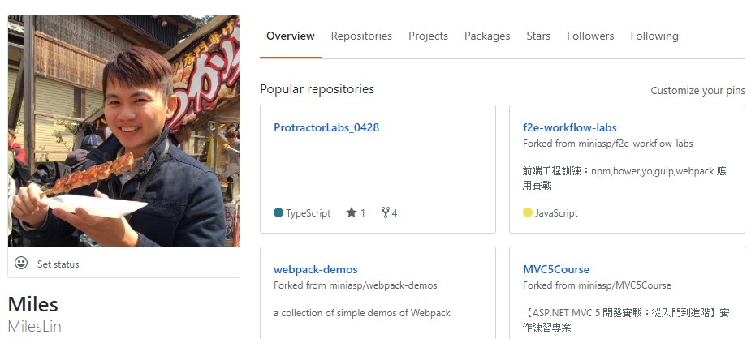 -->

* Install nodejs -> https://nodejs.org/en/

<!-- 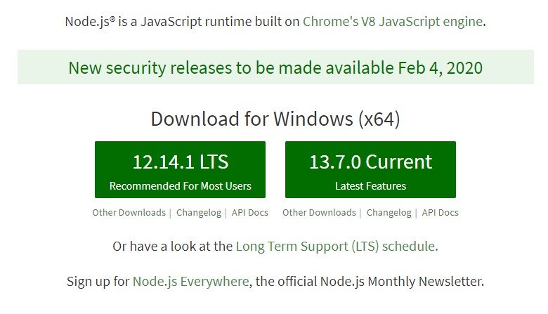 -->

* An IDE or text editor for writing, I use Visual Studio Code in the demo -> https://code.visualstudio.com/

<!-- 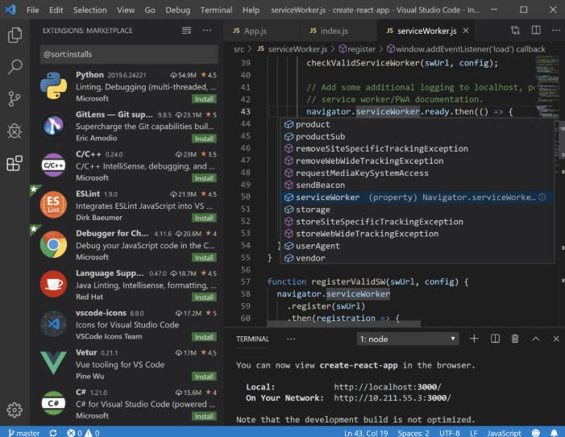 -->

## Initial Hexo project
1. Install Hexo by executing command below
``` bash
$ npm install hexo-cli -g
```

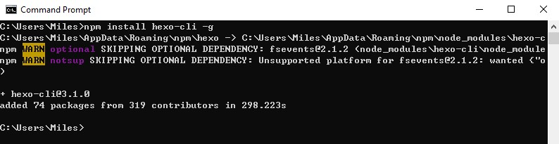


2. Create a hexo project
``` bash
$ hexo init projectname
ex: $ hexo init milesblog
```

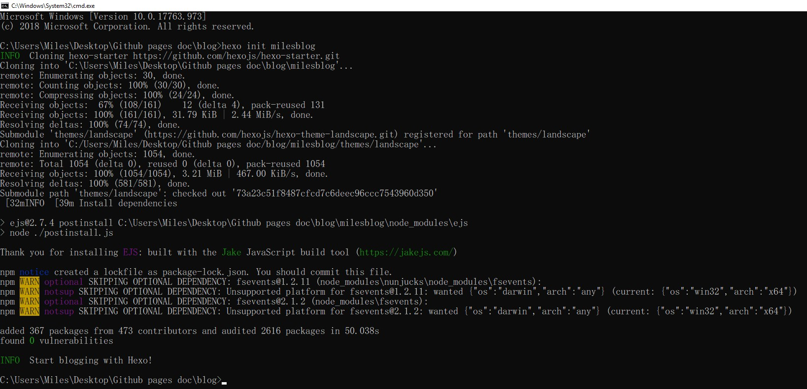

3. Run your blog website locally
``` bash
$ hexo server
or
$ hexo s
```
4. see http://localhost:4000 if works

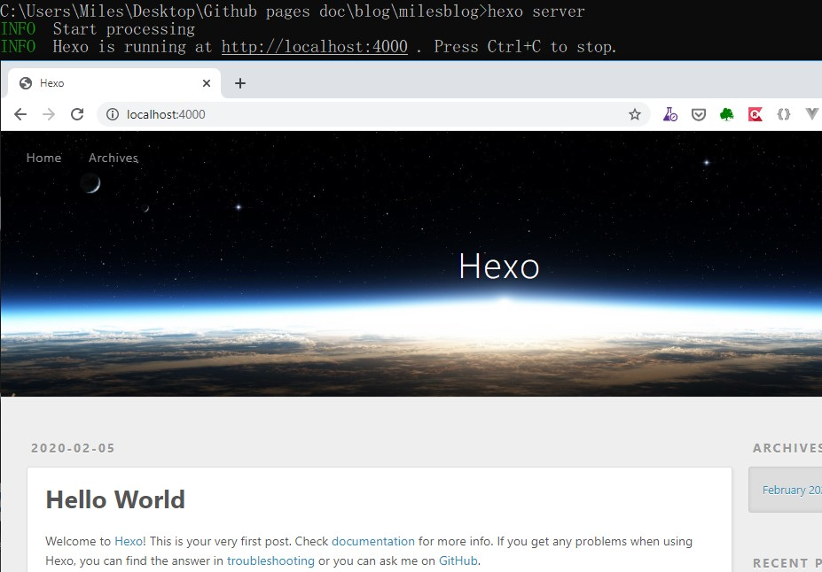

5. Create a new post
``` bash
$ hexo new hello-guys
```

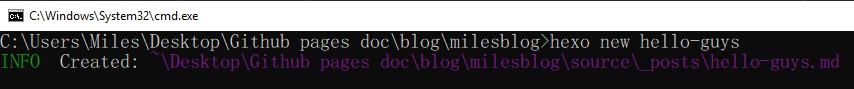

## Change theme
1. Pick a theme on https://hexo.io/themes. I use [Bootstrap-Blog](https://github.com/cgmartin/hexo-theme-bootstrap-blog) as the example.

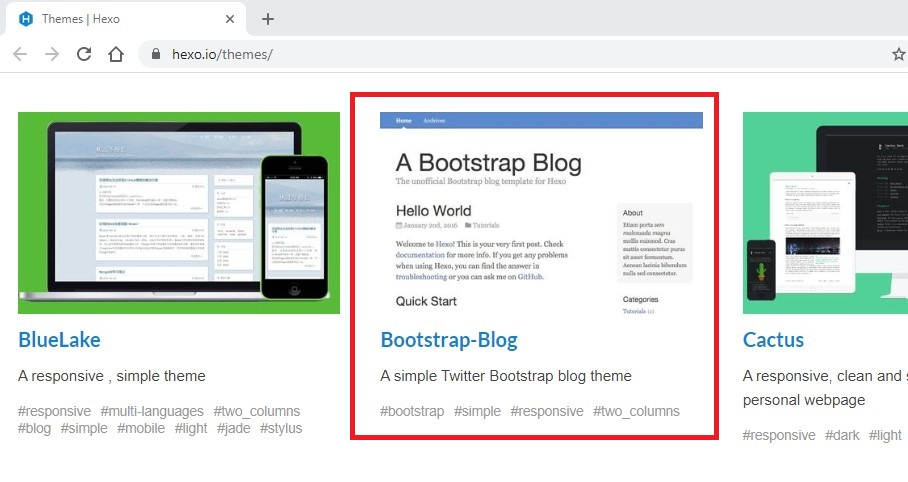

2. Download the theme by executing command below
``` bash
$ git clone https://github.com/cgmartin/hexo-theme-bootstrap-blog.git themes/bootstrap-blog
```

3. modify theme setting in `_config.yml`

change theme setting from `theme: landscape` to `theme: bootstrap-blog`

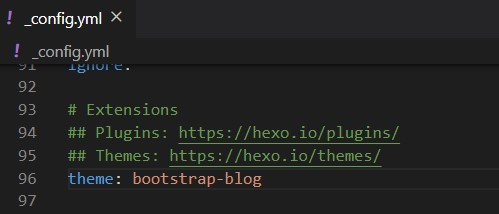

4. Run your blog website again
``` bash
$ hexo server
or
$ hexo s
```
5. see http://localhost:4000 if works

## Deploy to github pages
1. Create website static files by executing command below
``` bash
$ hexo generate
or
$ hexo g
```

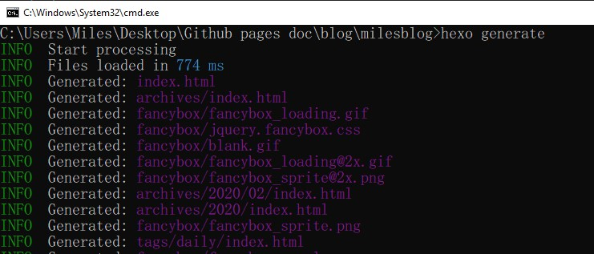

And the webiste static files will be generated in `public` folder. Our goal is push the content in public folder to github repository


2. [Create a repository](https://github.com/new) with name `[username].github.io`. Example, `milessecond.github.io`

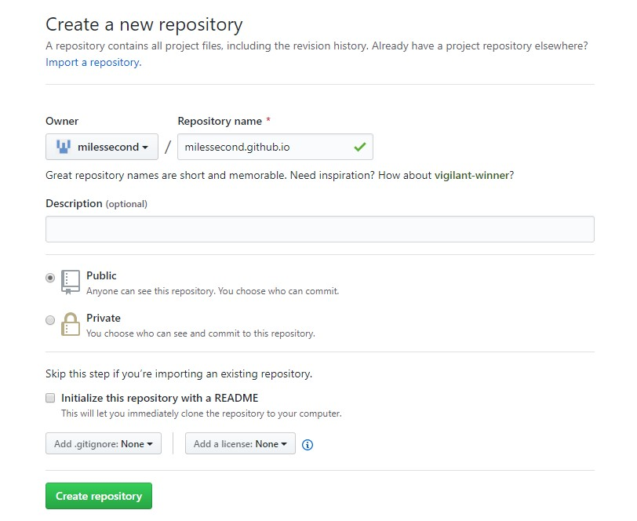

3. After creating repository, it will show the instruction that how to push files to repository.

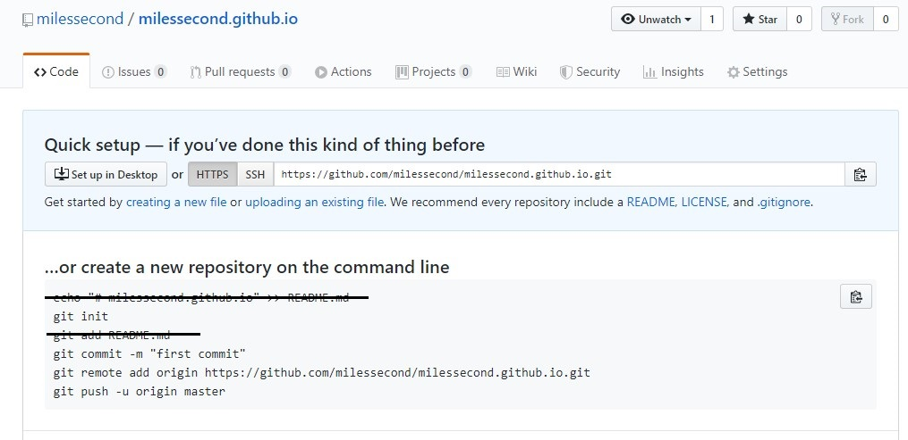

*note: we don't need to add README.md*

4. push files by executing commands below

``` bash
git init
git add .
git commit -m "first commit"
git remote add origin https://github.com/milessecond/milessecond.github.io.git
git push -u origin master
```
*It requires username andd password at the first push*

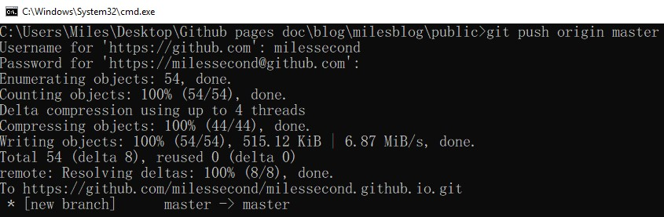

5. Your website is ready.
The website URL is https://username.github.io/, as my example here is https://milessecond.github.io/.

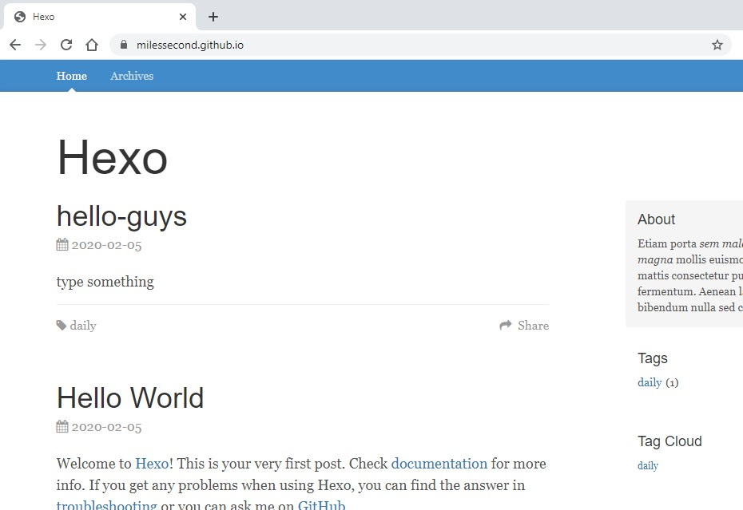


6. In the future push

After the first push, you just need to execute command below to push website static files.

``` bash
git add .
git commit -m "new post"
git push -u origin master
```

### Other deploy methods
* [Hexo - GitHub Pages](https://hexo.io/docs/github-pages)
* [Hexo - One-Command Deployment](https://hexo.io/docs/one-command-deployment)

## Other references
* [How to use Hexo and deploy to GitHub Pages](https://gist.github.com/btfak/18938572f5df000ebe06fbd1872e4e39)
* [Hexo - Commands](https://hexo.io/docs/commands)
* [Push-to-github-under-a-different-username](https://stackoverflow.com/questions/13103083/how-do-i-push-to-github-under-a-different-username)
* [GitHub Pages](https://pages.github.com/)
